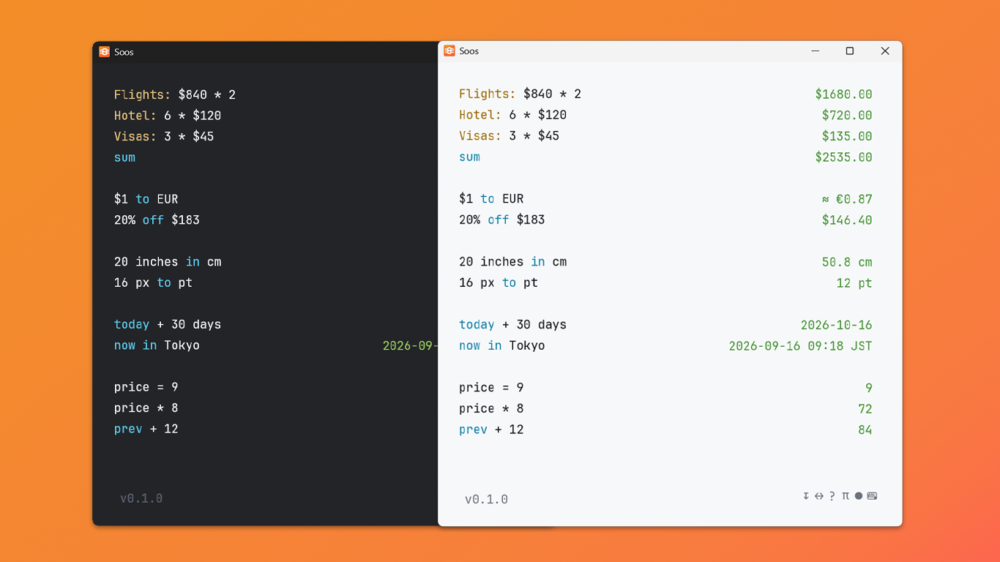

<div align="center">


# Soos

Fast, lightweight and reliable notepad-style calculator for Windows, macOS
and Linux. Every line is an expression -- the answer shows up beside it.

[](https://github.com/marelevn/soos/actions/workflows/ci.yml)
[](https://github.com/marelevn/soos/releases/latest)
[](LICENSE)



</div>

## Install

Download for your platform from the
[latest release](https://github.com/marelevn/soos/releases/latest):

- **Windows** -- unzip `soos-windows-x86_64.zip`, run `soos-app.exe`. No
  installer: Soos keeps its document and settings in a `data` folder next
  to the exe, so the whole thing is just that one folder -- move it, copy
  it, delete it, nothing else on your machine changes.
- **macOS** -- open the `.dmg`, drag Soos to Applications.
- **Linux** -- extract the `.tar.gz`, run `soos-app`.

All builds are unsigned for now, so Windows SmartScreen / macOS Gatekeeper
may warn on run.

> **"Soos is damaged and can't be opened" on macOS?**
>
> It isn't actually damaged -- Gatekeeper is just refusing to run an
> unsigned, unnotarized app.
>
> **Fix:** open Terminal and run:
> ```
> xattr -cr /Applications/Soos.app
> ```
> (or wherever you moved it), then launch it again.

Only two things touch the network, both plain HTTPS, no user data attached:
background currency-rate refresh, and a version check when you click the
version number in the status bar.

## Build from source

```
git clone https://github.com/marelevn/soos
cd soos
cargo build --release
./target/release/soos-app     # the GUI
./target/release/soos-cli "20 inches in cm"
```

On Linux you'll also need the GUI toolkit's dev headers first (Debian/
Ubuntu): `sudo apt install libxcb-render0-dev libxcb-shape0-dev libxcb-xfixes0-dev libxkbcommon-dev`.

## Usage

Click the `?` in the status bar for a live example -- natural-language
phrasing, currency conversion, units, dates and running totals, computed
by the real engine so it can't go stale.

A few things that aren't obvious at a glance:

- **Natural-language phrasing** -- `5% on 30`, `6% off 40 EUR`,
  `20% of what is 30 cm`, `$8 times 3`, `20 ml in tea spoons`.
- **Live currency**, no API key: 205 currencies blended from 98 central
  banks via [Frankfurter](https://frankfurter.dev), cached to disk and kept
  working offline on the last known rates.
- **Your own converters** -- click the `↔` symbol in the status bar
  for a small table (unit, aliases, base, factor) kept separate from the
  document, so clearing or rewriting your scratchpad never loses one. A bad
  alias is dropped rather than failing the whole row.
- **Desktop integration** -- tray icon, a rebindable global show/hide
  hotkey (the OS's Calculator key by default on Windows/Linux), closing
  hides to the tray instead of quitting.
- **`soos-cli`** for scripts: `soos-cli "20 inches in cm"`, `--json` for
  machine-readable output. An Alfred workflow and a PowerToys Run plugin
  are thin shells over it -- see `integrations/`.

## Contributing

See [CONTRIBUTING.md](CONTRIBUTING.md) for the dev setup, lint/test gates,
and release process.

## License

[MIT](LICENSE) -- do whatever you want with it, including commercially,
just keep the copyright notice.

Built on [fend](https://github.com/printfn/fend) (the expression engine),
[egui/eframe](https://github.com/emilk/egui) (the GUI), and a handful of
other MIT/Apache-2.0 crates -- see `Cargo.toml` for the full list. Rates
from [Frankfurter](https://frankfurter.dev); thanks to
[Numi](https://github.com/nikolaeu/numi) for the idea.
