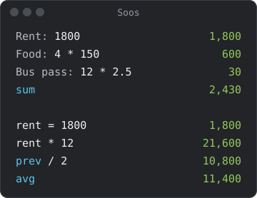
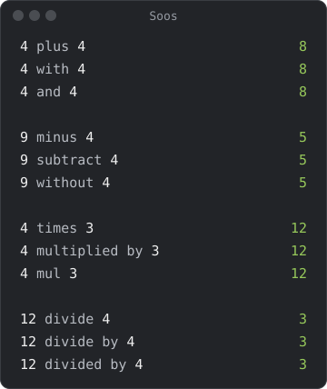
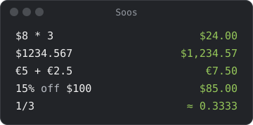
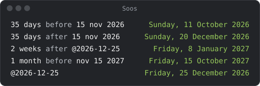

# Soos guide

Type on the left, read the answer on the right. The answers in these
pictures come from Soos itself, and a test fails if they change.

## [Totals and variables](totals.md)

Labels, blocks, `sum`, `avg`, `prev` and variables.

## [Phrases](phrasing.md)

Operators in words (`plus`, `divided by`), percent (`5% on 30`,
`5% on what is 105`), and numbers (`in sci`, `in hex`).

## [Money and units](money-and-units.md)

Currency symbols, exchange rates and rounding; `sq` and `cu`; your own
units.

## [Dates and time zones](dates-and-time.md)

`35 days before 15 nov`, `today + 3 days`, `3PM PST in Tokyo`.

## [The app](the-app.md)

Tabs, the status bar, the tray icon and the hotkey.

## Other pages

- [soos-cli](soos-cli.md): the same answers in a terminal or a script.
- [PowerToys Run plugin](powertoys.md): type `=20 inches in cm` in PowerToys
  Run (Windows).
- [Install help](install-help.md): where to put Soos, and what to do if
  Windows or macOS won't open it.
