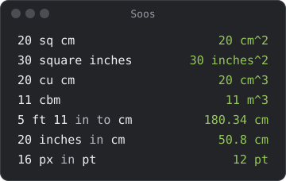

# Money and units

## Money

### Rates

Rates come from [Frankfurter](https://frankfurter.dev) and need no API key.
They are saved on your computer, so converting keeps working offline. Soos
fetches new ones when the saved ones are more than 6 hours old, and tries
again after a minute if that fails. The status bar says when they are more
than a day old.

A document in one currency works before the first rates arrive. Only
converting between two currencies needs them.

A plain number added to an amount counts as that currency: `$5 + 1` is
`$6.00`, as in a `sum`.

### Symbols

`$` is US dollars and `¥` is yen, so Australian and Singapore dollars and
Chinese yuan are written `A$`, `S$` and `CN¥`. No two currencies share a
symbol. You can type any symbol below, or a code such as `12 CAD`. A currency
with no symbol is shown with its code.

| Symbol | Currency |
|---|---|
| `$` | US dollar (USD) |
| `€` | Euro (EUR) |
| `£` | Pound sterling (GBP) |
| `¥` | Japanese yen (JPY) |
| `CN¥` | Chinese yuan (CNY) |
| `₩` | South Korean won (KRW) |
| `₹` | Indian rupee (INR) |
| `₫` | Vietnamese dong (VND), written after the number: `100 ₫` |
| `฿` | Thai baht (THB) |
| `₱` | Philippine peso (PHP) |
| `Rp` | Indonesian rupiah (IDR) |
| `RM` | Malaysian ringgit (MYR) |
| `S$` | Singapore dollar (SGD) |
| `A$` | Australian dollar (AUD) |

A symbol goes before the amount or after it, and works as the target of a
conversion too: `$5` or `5$`, `5 EUR in $`, `$1 in ₫`.

### Rounding

Currencies round half up to their usual decimals: none for JPY, KRW, VND,
IDR, ISK, CLP and others, three for KWD, BHD and others, two for the rest.
`$1234.567` shows as `$1,234.57`, and `12.345 CAD` as `12.35 CAD`.
Turn `±` on in the status bar to keep every digit.

`≈` marks a result that can't be written out in full, like `1/3` or
`arcsin(1)`. Logarithms carry it too, since they are worked out
approximately: `log 100` is `≈ 2`. In money it is rounded as above:
`$10 / 3` is `≈ $3.33`. Any other number shows four decimals, or four
significant digits below 1: `1/300` is `≈ 0.003333`. To see every digit,
hover over the result, copy it, or turn `±` on.

### Copy

Click a result to copy it without thousands separators (`$1234567.89`). It
pastes back into Soos as the same amount.

## Units

- A plain number added to a unit counts as that unit: `5 m + 1` is `6 m`.
  Two different units (`5 m + 1 kg`) are still an error.
- `sq` and `cu` work like `square` and `cubic`: `20 sq cm`, `5 cu ft`.
- After a unit, `/ 2 s` divides by the whole `2 s`: `6 m / 2 s` is `3 m / s`,
  and `$40 / 2 hours` is `20 USD / hour`. A plain number on the left keeps
  the usual reading, so `1/2 cup` is half a cup.
- `in` is also the unit inches: `3 in` is 3 inches, and `5 ft 11 in` is 5
  feet 11 inches. Between two units it converts: `20 inches in cm`. As the
  target it is the unit: `5 cm to in`.
- Soos adds the screen units `px`, `pt`, `pc`, `rem`, `em` and `ch`. An inch
  is 96 px or 72 pt. A `pc` is 12 pt (16 px), `rem` and `em` are 16 px, and
  `ch` is 8 px. `pt` is points, not pints, `pc` is picas, not parsecs, and
  `ch` is not a chain: write `pint`, `parsec` and `chain`. `rem` is the CSS
  unit, not the radiation dose.

## Your own converters

Click `↔` in the status bar to open a table of your own units, with four
columns:

| Column | Holds |
|---|---|
| unit | the name you will type |
| aliases | other names for it |
| base | a unit Soos already knows |
| factor | a number: 1 unit is this many bases |

For example, `lap`, aliases `laps`, base `m`, factor `400` makes `1 lap` 400
m. The table is kept apart from the document, so clearing your scratchpad
never loses a converter. A bad alias is dropped rather than failing the whole
row.
