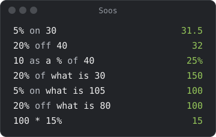
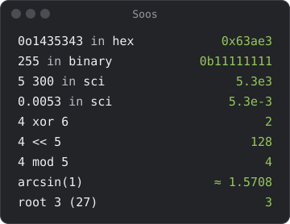

# Phrases

## Operators in words

| Symbol | Or say |
|---|---|
| `+` | `plus`, `with`, `and` |
| `-` | `minus`, `subtract`, `without` |
| `*` | `times`, `multiplied by`, `mul` |
| `/` | `divide`, `divide by`, `divided by` |

`&`, `|`, `xor`, `<<` and `>>` work as they do in code; write `&` for a
bitwise AND, since `and` is a plus. `^` is a power, not XOR: `2 ^ 3` is 8, and
`2 xor 3` is 1. `mod` takes positive whole numbers: `-5 mod 3` is an error.

A shift over 100,000 places and a power over 10,000 say `too large`. The
engine can't be stopped partway through one, so a line like `4 << 100000000`
would freeze every tab until you restarted; Soos refuses it first. For the
same reason there are no dice: `4d6` says `no dice`.

## Percent

- `on` adds a percent and `off` takes it away: `5% on 30` is 31.5, and
  `20% off 40` is 32.
- A `%` after `+` or `-` is the plain fraction, as in any expression: `30 + 5%`
  is 30.05. So `$100 - 15%` is an error (`needs on or off`), since a percent
  isn't an amount of money. Say `15% off $100`.
- `on` and `off` take the rest of the line: `20% off 100 + 20` is 20% off 120,
  which is 96. To add something after, put the phrase in brackets:
  `(20% off 100) + 20` is 80.
- `20% of what is 30` is 150: the number that 30 is 20% of.
- `5% on what is 105` is 100: the price before 5% was added.
  `20% off what is 80` is 100: the price before 20% came off.
- `fee on cost` needs `fee` to hold a percent (`fee = 8%`).

## Numbers and functions

- `5300 in sci` (or `to scientific`) is `5.3e3`. Soos reads that back, so a
  copied result pastes as the same number.
- A number may have spaces between its thousands: `5 300`.
- `in hex`, `in binary`, `in octal` and `in base 3` convert a number.
- `arcsin`, `arccos` and `arctan` are the inverse trig functions, and
  `root 3 (27)` is the cube root of 27. An odd root of a negative number is
  real, so `root 3 (-8)` and `cbrt(-8)` are -2; a power is not a root, and
  `(-8)^(1/3)` is the complex `≈ 1 + 1.7321i`.
- Angles are in radians unless you say `deg`: `sin 30 deg` is 0.5 and
  `sin 30` is `≈ -0.988`.
