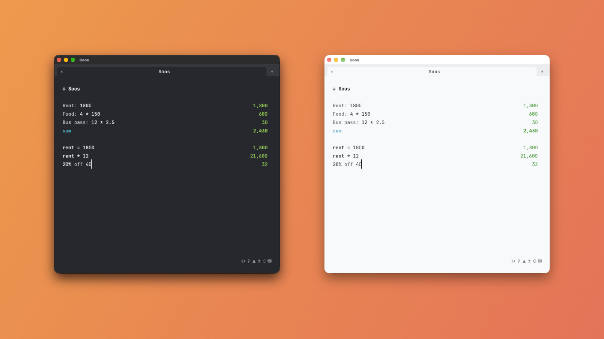

# The app

## Tabs

Up to 9, each its own scratchpad. Soos saves their text when you close it
and brings it back next time.

| To | Do |
|---|---|
| Add a tab | Click `+` in the tab strip, or press Cmd/Ctrl+T |
| Close a tab | Click the `×` on it, middle-click it, or press Cmd/Ctrl+W |
| Bring back the last one you closed | Cmd/Ctrl+Shift+T |
| Switch | Cmd/Ctrl+1-9, or Ctrl+Tab and Ctrl+Shift+Tab |
| Zoom the text | Cmd/Ctrl and `+` or `-`; Cmd/Ctrl and `0` resets it |

## The result column

- Every result ends on the column's right edge, and totals are bold.
- An error on the line you're typing waits until you pause.
- A slow document never holds up the typing: until its results are ready,
  the old ones stay, dimmed.

## The status bar

Left to right. Hover over an icon to see what it does.

| Icon | Does |
|---|---|
| `↔` | Opens your converters |
| `?` | Shows a worked example |
| `▲` | Keeps the window on top |
| `0.1` `0,1` | Decimal mark: a point (`1,234.5`) or a comma (`1.234,5`). Click to switch |
| `±` | Shows every digit of a currency amount, not just its usual decimals |
| `◌` `○` `●` | Theme: follows the system, light, dark. Click to cycle |
| `⌨` | Sets the global hotkey |

With the comma on, `.` groups thousands and `,` is the decimal mark, both in
what you type and in the results: `3,5 + 1` is `4,5`, and `3.000.000` is
three million. Only how numbers are read and shown changes: the document is
saved as you typed it, and soos-cli still reads `1,234.5`. A converter's
factor follows the setting too. The point is the default because `3,000,000`
is three million there.

The version number sits in the bar too: click it to check for a new
version. The bar also says `rates offline` until the first exchange rates
arrive, and `rates 2 days old` (for example) once the saved ones are more
than a day old.

## Tray, Dock and hotkey

A tray icon (the menu bar on macOS): click it to show the window,
right-click it for Quit.

| | Windows | macOS | Linux |
|---|---|---|---|
| Closing the window | hides it to the tray | minimizes it; the Dock icon brings it back | quits |
| Global hotkey shows and hides it | Calculator key | Ctrl+Shift+Space; hiding also removes the Dock icon | none |
| Always on top `▲` | yes | yes | none |

Click `⌨` and press a key to change the hotkey. If the tray icon fails to
appear on Windows or macOS, closing the window quits instead of hiding it.

Wayland can't do a global hotkey, always-on-top or hiding to the tray, so
Soos turns all three off on every Linux desktop, X11 included. Some desktops
(GNOME without an AppIndicator extension) show no tray at all.
